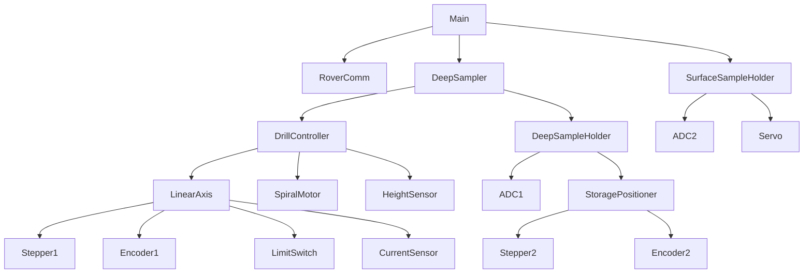

# Drilling
Repo for Deep Sampling Sub-Task
Release 2025 was mostly a success and allowed us to identify its shortcomings.
Currently working on an overhauled design.

## Authors

- **Vilem Strachon** *(Leader)*  
  Responsible for the weighing and storing.

- **Martin Kriz**  
  Senior consultant.

- **Filip Slima**  
  Responsible for mechanical construction, linear motion system.

- **Ondrej Stafa**  
  Responsible for DC motor control.

## ESP software structure

## Communication protocol
[Here](communicationProtocol.md)
